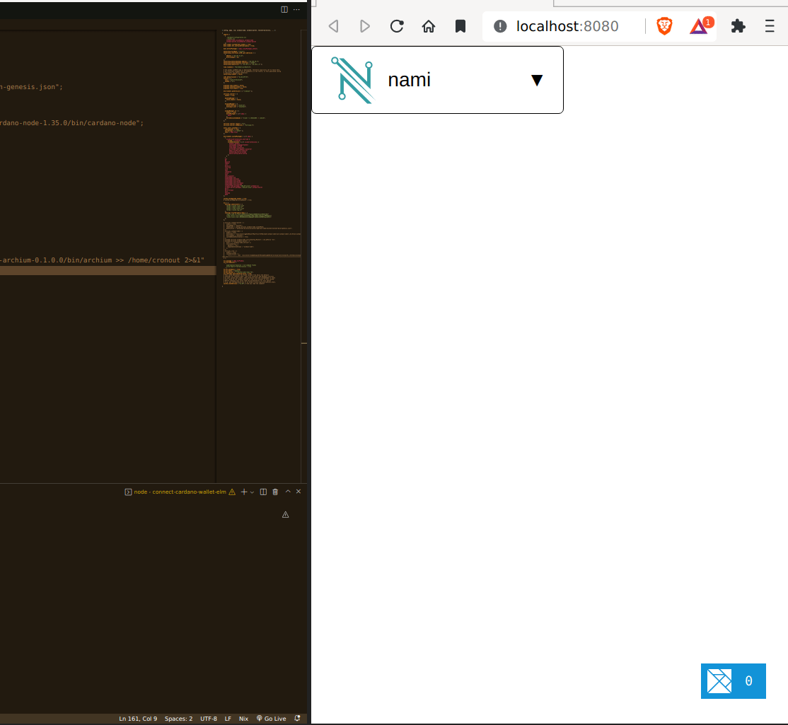

# connect-cardano-wallet-elm

Connect Nami, Eternl, or Flint wallets to an elm application

Install dependencies with `yarn install` then start development mode with `yarn development-connect-cardano-wallet-elm`

Create production build with `build-connect-cardano-wallet-elm`

Start a web server with `start-connect-cardano-wallet-elm`

A state machine utility to connect to the Cardano wallets Nami, Eternl, and Flint.  It's not suitable for an Elm package because this application is reliant on the npm package cardano-lucid

https://github.com/Berry-Pool/lucid

The best way to use this utility is to clone it and then reference the src folder from within the elm.json file of your project.

See below for a screen caputre of usage

